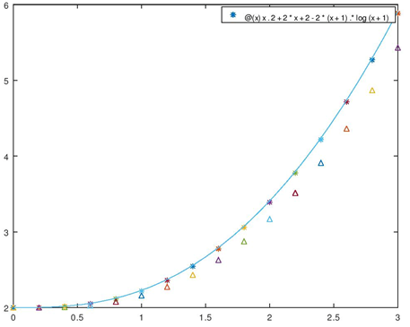
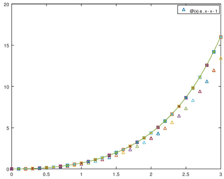
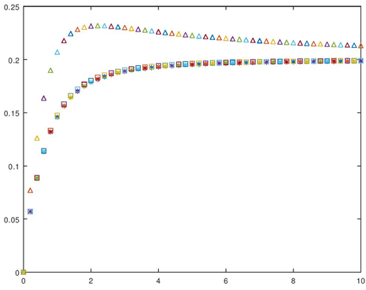

# euler-taylor-methods
Euler (3 versions) and Taylor methods implemented using Octave, used on some differential equations. Code also produces comparison plots for the methods' results.

<h1>taylor_euler.m</h1>

  Second order Taylor method's points are represented with an asterisk. Euler method's points are represented with a triangle. Exact solution's points are represented with a line.

<h1>euler1.m</h1>

  Euler method's points are represented with a triangle. Modified Euler method's points are represented with an asterisk. Improved Euler method's points are represented with a square. Exact solution's points are represented with a line.

<h1>euler2.m</h1>

  Euler method's points are represented with a triangle. Modified Euler method's points are represented with an asterisk. Improved Euler method's points are represented with a square. Exact solution's points are represented with a line.

<h1>calculate_errors.m</h1>

  Euler method's error points are represented with a triangle. Modified Euler method's error points are represented with an asterisk. Improved Euler method's error points are represented with a square.

